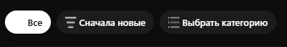
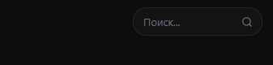
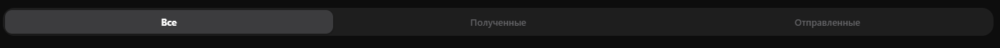
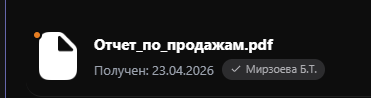
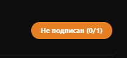
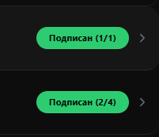
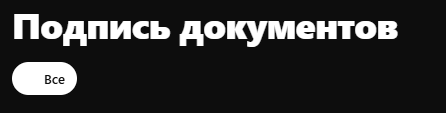
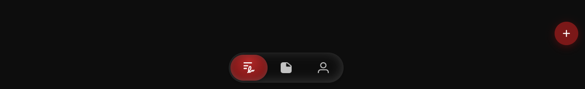
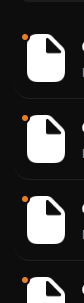
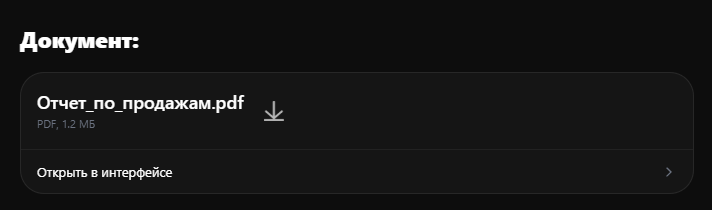

1. ШРИФТ SF PRO DISPLAY (лежит в папке Fonts в FigmaMPKDocuments)
2.  - здесь исправить. Иконки вообще не видно + они какие-то растянутые. 
3.  - Поиск очень короткий, он не должен увеличиваться при нажатии а изначально должен быть длинным + он должен быть liquid glass
4.  - исправить ширину разделов, слишком широкие
5.  - точка должна быть СЛЕВА ОТ ТЕКСТА, а не на документе. 
6.  - цвета ты так и не исправил, до сих пор "не подписан" какой-то оранжевый, а не BEA800
7.  - почему здесь текст стал черным? он должен быть белым
8.  - опять на фильтрах иконку не видно и она растянута 
9.  - просмотреть отклоненные тоже иконку растянуло
10.  - тоже самое, что и в пункте 9
11.  - кнопка "+" должна быть на каждой странице, а также она должна быть на уровне с навбаром
12.  - нет надписи с расширением файла
13.  - кнопка загрузки должна быть справа в блоке
14. 